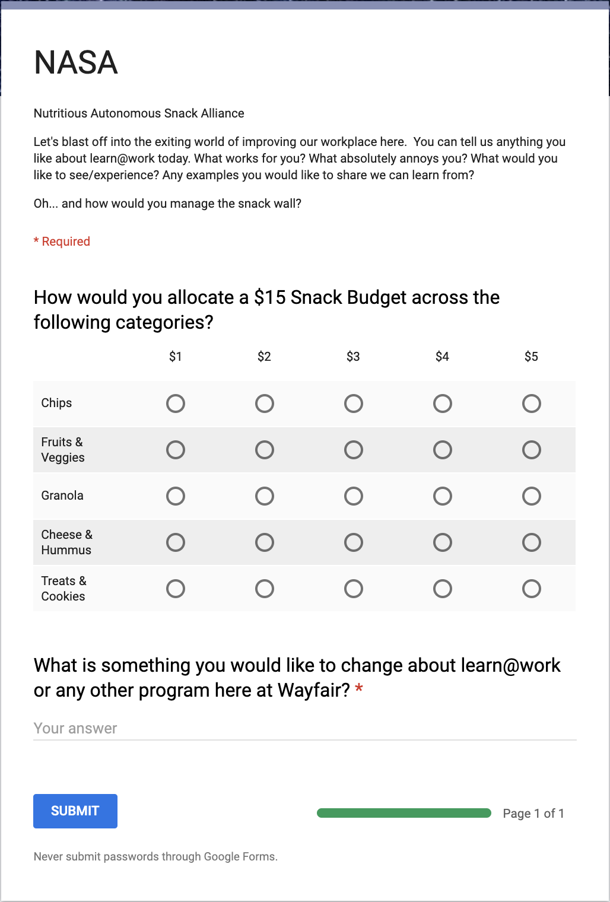

**N**oninvasive **A**utonomous **S**nack **A**lliance (NASA)

**Wa**fair **F**eedback **A**pp (WAFA)

Pushing forward a healthy workplace via the power of culture and voting.  MVP manifests itself as a tool for giving feedback to Wayfair, starting with general feedback near snack walls but leads to automating all kinds of decesions through the org.

📉🙇📣🙇📈

- [x] Snacks
- [ ] Charitable Donations (Walkout Issue)
- [ ] Health & Wellness (Gym Passes)
- [ ] Culture (Pod Outings & Parties)
- [ ] Vision (Values & Priorities)
 
---

### Overview
Wayfair has an amount per employee that they are spending on snacks.  Give greater influence over the items bought with this money in a democratic fashion, then spread to other wellness and cultural perks -- essentially automating away some internal roles in favor of automated democracy.

In principal this is a fun project to examine how internal HR and Wellness initiatives can use technologies to start incentivizing feedback loops in the org.  This will both give greater insight as a type of "culture thermometer" but also will enable the ability to stear the culture in a particular direction through the means of incentivization. General concepts and methodoligies taken from decentralized patterns and structures gleaned from cryptocurrency projects such as Bitcoin and The DAO.

---

### User Story
Mark has had a few ideas on how to improve the review proccess here at Wayfair.  He doesn't feel it's a big enough deal to actually surface to HR but thinks it is valuable nonetheless.

One afternoon Mark goes to get carrots from the kitchen but they are all out.  He sees there are plenty of other choices, and loves that Wayfair provides all kinds of carb based choices like crackers and chips, but wishes he had more vegeteable choices.

As he's about to leave back to his desk slightly disapointed when he sees a sign prompting for feedback on the snacks.  He scans the QR code, simply selects that he'd rather have his small portion of money go towards vegetables or even a specific vegitable over a specific type of chip -- because he likes the rice chips.  

The form also asks for general feedback about Wayfair, to which he gives his review feedback that he previously was not going to say anything about.  After completion he can see a moderated list of other ideas submited and give upvotes to ones he feels are genuinely good ideas.

Two weeks later he get's an update that one of the topics he upvoted has had a ticket submitted and is actually being worked on by the org.  He feels empowered to voice his opinion and knows where to go next time he has something to give feedback on.

---
### Survey
I've created a sample google form survey that they would be directed to via [http://bit.ly/2Ga8C3d](http://bit.ly/2Ga8C3d) that looks like this:

However, if proven successfull I would like a chrome extension that then is used to send followup questions or incentivize other feedback in the future.  I already have a development basic version of this setup if you'd like to see it.

---
### Metrics & Outstanding Questions
Our goal is to collect 100 responses.  It will be interesting to see how many of the comments are actionable and how many wayfair is already workin on, or possibly already implicated.

- What impact can people *really* have on the snack choices?
- How much money per employee is dedicated to snacks?
- Is a list of all snacks and costs available?
- Is it possible to have different snacks in different kitchens?
- Can we introduce new food choices?  Like veggies in the mornings as well as fruit?

